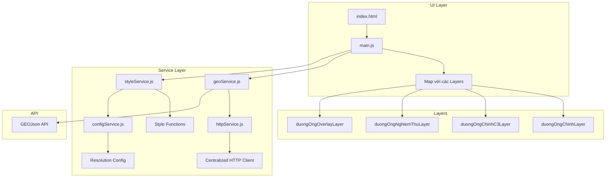

# Kế hoạch Refactor GIS-Tizen

## 1. Phân tích Hiện trạng

### 1.1. Các loại Đường ống trong nawasco-web-gis

Từ phân tích codebase `nawasco-web-gis`, có **4 loại đường ống** được hiển thị:

| Layer Name | API Endpoint | File Layer | Mô tả |
|------------|--------------|------------|-------|
| ViewDuongOngChinhs | `GEOJson/Index?LAYERS=ViewDuongOngChinhs` | NLayerDuongOngChinh.js | Đường ống chính |
| ViewDuongOngChinhC3s | `GEOJson/Index?LAYERS=ViewDuongOngChinhC3s` | NLayerDuongOngChinhC3.js | Đường ống chính cấp 3 |
| ViewDuongOngNghiemThus | `GEOJson/Index?LAYERS=ViewDuongOngNghiemThus` | NLayerDuongOngNghiemThu.js | Đường ống nghiệm thu |
| DuongOngChinhOverlays | `GEOJson/Index?LAYERS=DuongOngChinhOverlays` | NLayerDuongOngChinhOverlay.js | Đường ống kết nối overlay |

### 1.2. Logic Hiển thị theo Zoom Levels

Cấu hình resolution trong [`config/resolution.js`](../nawasco-web-gis/config/resolution.js:1):

```javascript
export const RESOLUTION_DISPLAY_NAME_PIPELINE = {
    DIAMETER_FROM_700_TO_1200: 12,    // Đường kính 700-1200mm: hiển thị từ resolution 12
    DIAMETER_FROM_350_TO_700: 8,      // Đường kính 350-700mm: hiển thị từ resolution 8
    DIAMETER_FROM_160_TO_350: 5,      // Đường kính 160-350mm: hiển thị từ resolution 5
    DIAMETER_FROM_80_TO_160: 2,       // Đường kính 80-160mm: hiển thị từ resolution 2
    DIAMETER_FROM_40_TO_80: 1,        // Đường kính 40-80mm: hiển thị từ resolution 1
    DIAMETER_FROM_15_TO_40: 0.5,      // Đường kính 15-40mm: hiển thị từ resolution 0.5
};
```

**Quy tắc hiển thị:**
- Đường ống có đường kính lớn → hiển thị ở zoom level thấp hơn, resolution cao hơn
- Đường ống có đường kính nhỏ → chỉ hiển thị khi zoom gần, resolution thấp hơn
- Logic này áp dụng cho việc hiển thị **label/tên vật liệu** trên đường ống

### 1.3. Quy tắc Màu sắc Đường ống

Từ [`NLayerDuongOngChinh.js`](../nawasco-web-gis/components/layers/NLayerDuongOngChinh.js:27):

| Điều kiện | Màu sắc |
|-----------|---------|
| MaLoaiVatLieu == Thép | Đỏ - red |
| HDPE && DuongKinh == 110 | Xanh lá - green |
| HDPE && DuongKinh == 90 | Xanh ngọc - cyan |
| HDPE && DuongKinh == 63 | Xanh dương - blue |
| HDPE && DuongKinh == 50 | Hồng - #F56A80 |
| HDPE && DuongKinh < 50 | Vàng - yellow |
| DuongKinh > 250 | Cam - orange |
| DuongKinh >= 150 | Tím - purple |
| Còn lại | Nâu - brown |

### 1.4. So sánh Pattern Gọi API

#### Pattern chuẩn trong nawasco-web-gis/services/

```
services/
├── httpService.ts          # Centralized axios instance với interceptors
├── tiles/
│   ├── tileService.ts      # Service class pattern
│   └── dto/
│       └── GetTileRequest.ts
├── duongOngChinhs/
│   ├── duongOngChinhService.ts
│   └── dto/
│       ├── UpdateInfoLineOfDuongOngChinhInput.ts
│       └── ViewDuongOngChinh.ts
└── ...
```

**Đặc điểm:**
- Sử dụng TypeScript
- Class-based services với async methods
- Export singleton instance: `export default new ServiceName()`
- Centralized HTTP client với interceptors xử lý auth token
- DTOs được định nghĩa trong thư mục dto/

#### Pattern hiện tại trong gis-tizen/service/

```
service/
├── geoService.js           # Function-based, dùng fetch trực tiếp
└── styleService.js         # Utility functions cho styling
```

**Vấn đề:**
- Không có centralized HTTP client
- Không có error handling thống nhất
- Không có interceptors cho auth
- Naming convention không nhất quán

---

## 2. Kế hoạch Thực hiện

### 2.1. Refactor Service Layer

#### Bước 1: Tạo httpService.js

Tạo file [`service/httpService.js`] với pattern giống [`services/httpService.ts`](../nawasco-web-gis/services/httpService.ts:1):

```javascript
// service/httpService.js
const API_BASE_URL = 'http://118.70.151.182:1223';

class HttpService {
    constructor(baseURL) {
        this.baseURL = baseURL;
        this.defaultHeaders = {
            'accept': '*/*',
            'accept-language': 'vi,en-US;q=0.9,en-GB;q=0.8,en;q=0.7',
            'Content-Type': 'application/json'
        };
    }

    async get(endpoint, options = {}) {
        // Implementation với error handling
    }

    async post(endpoint, data, options = {}) {
        // Implementation
    }

    // ... other methods
}

export default new HttpService(API_BASE_URL);
```

#### Bước 2: Tạo configService.js

Tạo file [`service/configService.js`] với config giống [`config/resolution.js`](../nawasco-web-gis/config/resolution.js:1):

```javascript
// service/configService.js
export const RESOLUTION_DISPLAY_NAME_PIPELINE = {
    DIAMETER_FROM_700_TO_1200: 12,
    DIAMETER_FROM_350_TO_700: 8,
    DIAMETER_FROM_160_TO_350: 5,
    DIAMETER_FROM_80_TO_160: 2,
    DIAMETER_FROM_40_TO_80: 1,
    DIAMETER_FROM_15_TO_40: 0.5,
};

export const LAYER_NAMES = {
    DUONG_ONG_CHINH: 'ViewDuongOngChinhs',
    DUONG_ONG_CHINH_C3: 'ViewDuongOngChinhC3s',
    DUONG_ONG_NGHIEM_THU: 'ViewDuongOngNghiemThus',
    DUONG_ONG_OVERLAY: 'DuongOngChinhOverlays'
};
```

#### Bước 3: Refactor geoService.js

Chuyển thành class-based service:

```javascript
// service/geoService.js
import http from './httpService.js';
import { LAYER_NAMES } from './configService.js';

class GeoService {
    async getGeoJsonByLayer(layerName) {
        return http.get(`/GEOJson/Index?LAYERS=${layerName}`);
    }

    async getDuongOngChinh() {
        return this.getGeoJsonByLayer(LAYER_NAMES.DUONG_ONG_CHINH);
    }

    async getDuongOngChinhC3() {
        return this.getGeoJsonByLayer(LAYER_NAMES.DUONG_ONG_CHINH_C3);
    }

    async getDuongOngNghiemThu() {
        return this.getGeoJsonByLayer(LAYER_NAMES.DUONG_ONG_NGHIEM_THU);
    }

    async getDuongOngOverlay() {
        return this.getGeoJsonByLayer(LAYER_NAMES.DUONG_ONG_OVERLAY);
    }
}

export default new GeoService();
```

#### Bước 4: Cập nhật styleService.js

Thêm logic hiển thị theo resolution/zoom:

```javascript
// service/styleService.js
import { RESOLUTION_DISPLAY_NAME_PIPELINE } from './configService.js';

export function configDisplayNamePipeline(feature, resolution) {
    const duongKinh = Number(feature.get('DuongKinh'));
    
    switch (true) {
        case duongKinh <= 40:
            return resolution <= RESOLUTION_DISPLAY_NAME_PIPELINE.DIAMETER_FROM_15_TO_40
                ? feature.get('VatLieu') : '';
        case duongKinh <= 80:
            return resolution <= RESOLUTION_DISPLAY_NAME_PIPELINE.DIAMETER_FROM_40_TO_80
                ? feature.get('VatLieu') : '';
        // ... các case khác
    }
}

export function duongOngStyleFunction(feature, resolution) {
    // Style với text hiển thị theo resolution
}
```

### 2.2. Cập nhật main.js

Thêm các layer mới và logic load:

```javascript
// main.js
import geoService from './service/geoService.js';
import { duongOngStyleFunction, duongOngNghiemThuStyleFunction } from './service/styleService.js';

// Tạo sources cho các layer
const duongOngChinhSource = new VectorSource();
const duongOngChinhC3Source = new VectorSource();
const duongOngNghiemThuSource = new VectorSource();

// Tạo layers
const duongOngChinhLayer = new VectorLayer({
    source: duongOngChinhSource,
    style: duongOngStyleFunction,
    title: 'Đường ống chính',
    visible: true
});

const duongOngChinhC3Layer = new VectorLayer({
    source: duongOngChinhC3Source,
    style: duongOngStyleFunction,
    title: 'Đường ống C3',
    visible: true
});

const duongOngNghiemThuLayer = new VectorLayer({
    source: duongOngNghiemThuSource,
    style: duongOngNghiemThuStyleFunction,
    title: 'Đường ống nghiệm thu',
    visible: false  // Mặc định ẩn
});

// Load all layers
async function loadAllLayers() {
    await Promise.all([
        loadDuongOngChinh(),
        loadDuongOngChinhC3(),
        loadDuongOngNghiemThu()
    ]);
}
```

### 2.3. Cập nhật index.html

Thêm legend đầy đủ và layer switcher:

```html
<!-- Thêm layer switcher -->
<div id="layer-switcher" class="layer-switcher">
    <h4>Lớp bản đồ</h4>
    <label><input type="checkbox" id="layer-duongong" checked> Đường ống chính</label>
    <label><input type="checkbox" id="layer-duongong-c3" checked> Đường ống C3</label>
    <label><input type="checkbox" id="layer-nghiemthu"> Đường ống nghiệm thu</label>
</div>

<!-- Cập nhật legend với thêm section cho các loại đường ống khác -->
```

---

## 3. Sơ đồ Kiến trúc



---

## 4. Danh sách Files cần tạo/sửa

| File | Action | Mô tả |
|------|--------|-------|
| service/httpService.js | CREATE | Centralized HTTP client |
| service/configService.js | CREATE | Resolution và layer config |
| service/geoService.js | REFACTOR | Class-based, thêm methods cho tất cả layers |
| service/styleService.js | REFACTOR | Thêm logic resolution-based display |
| main.js | REFACTOR | Thêm các layers mới, load logic |
| index.html | UPDATE | Thêm layer switcher và cập nhật legend |
| style.css | UPDATE | Thêm styles cho layer switcher |

---

## 5. Lưu ý Khi Implement

1. **Giữ backward compatibility**: Đảm bảo các function export cũ vẫn hoạt động
2. **Error handling**: Thêm try-catch và error logging nhất quán
3. **Resolution logic**: Test kỹ việc hiển thị label theo zoom levels
4. **Performance**: Cân nhắc lazy loading cho các layer không cần thiết ngay lập tức
5. **API compatibility**: Kiểm tra API endpoints có sẵn và response format
